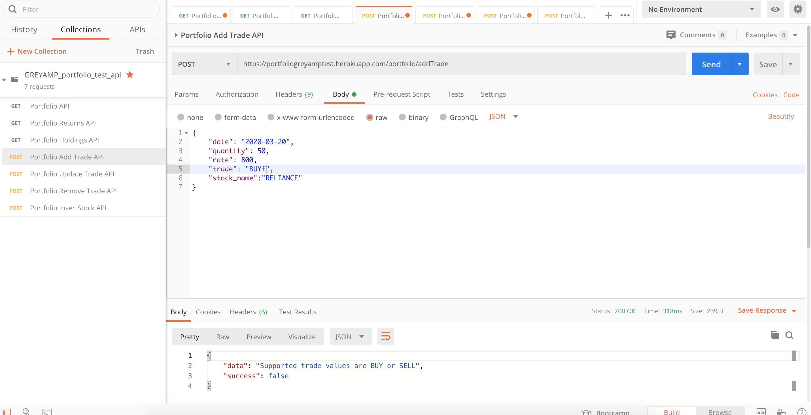
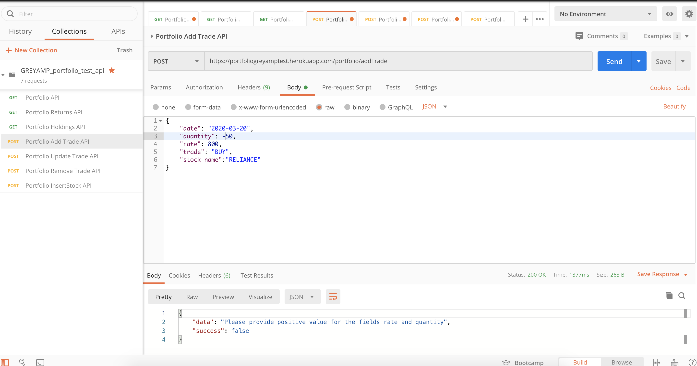
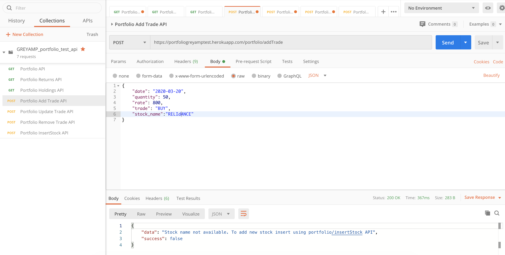
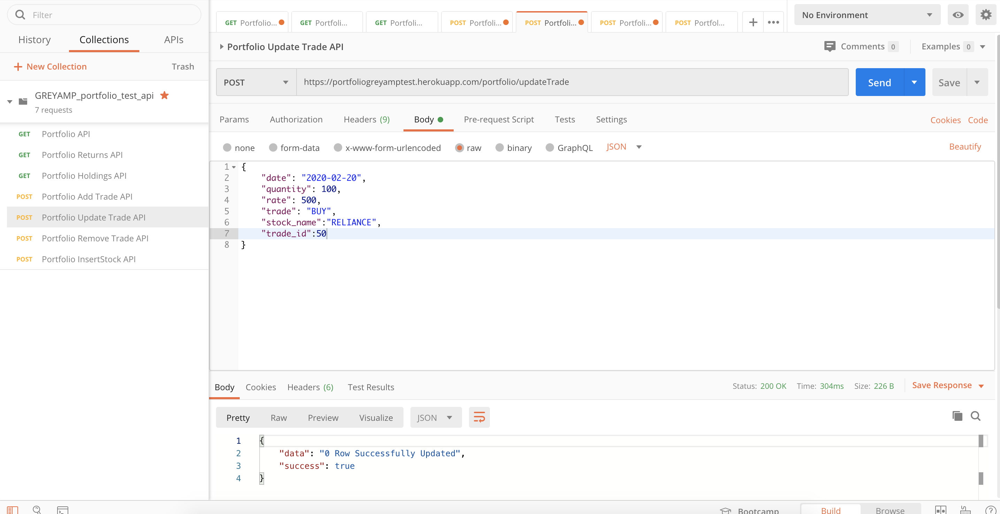
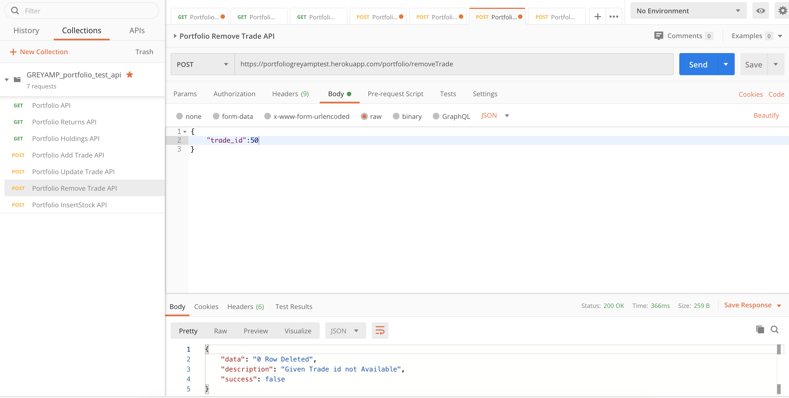
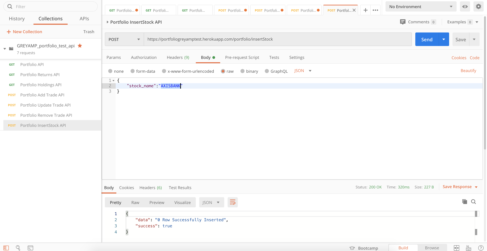

&nbsp;&nbsp;&nbsp;&nbsp;&nbsp;&nbsp;&nbsp;&nbsp;&nbsp;&nbsp;&nbsp;&nbsp;&nbsp;
&nbsp;&nbsp;&nbsp;&nbsp;&nbsp;&nbsp;&nbsp;&nbsp;&nbsp;&nbsp;&nbsp;&nbsp;&nbsp;


[](https://github.com/utkarshut/portfoliogreyamptest/issues)

<br><br>

# Portfolio

**Database** 

ClearDB , ClearDB on Heroku enables you to build your apps using native MySQL databases
[Clear DB Details](https://elements.heroku.com/addons/cleardb)

**REST Framework**

FLASK , Flask-RESTful is an extension for Flask that adds support for quickly building REST APIs. It is a lightweight abstraction that works with your existing ORM/libraries. Flask-RESTful encourages best practices with minimal setup
[Flask Details](https://flask-restful.readthedocs.io/en/latest/)

**Deployment Server**

Heroku, Heroku is a platform as a service (PaaS) that enables developers to build, run, and operate applications entirely in the cloud
[Heroku Details](www.heroku.com)

**File/Folder Details** 
- Media - Media folder contains all the screenshot images.
[Media folder](https://github.com/utkarshut/portfoliogreyamptest/tree/master/Media)
- Sql - Sql folder contains the sql files to create tables.
[Sql folder](https://github.com/utkarshut/portfoliogreyamptest/tree/master/Sql)
- Config - Config folder contains the database configuration files.
[Config folder](https://github.com/utkarshut/portfoliogreyamptest/tree/master/config)
- Static - Static folder contains the static error messages.
[Static folder](https://github.com/utkarshut/portfoliogreyamptest/tree/master/static)
- app.py - It contains all the route param with function defined for each route param.In this file only all the errors are
handled. [app.py file](https://github.com/utkarshut/portfoliogreyamptest/blob/master/app.py)
- requirement.txt - Requirement file has all the dependencies for the application.
[requirement.txt file](https://github.com/utkarshut/portfoliogreyamptest/blob/master/requirements.txt)


## Features

### Portfolio

- Endpoint - https://portfoliogreyamptest.herokuapp.com/portfolio
- Method - GET
- Example :


### Portfolio Holdings

- Endpoint - https://portfoliogreyamptest.herokuapp.com/portfolio/holdings
- Method - GET
- Example :


### Portfolio Returns

- Endpoint - https://portfoliogreyamptest.herokuapp.com/portfolio/returns
- Method - GET
- Example :


### Portfolio Add Trade

- Endpoint - https://portfoliogreyamptest.herokuapp.com/portfolio/addTrade
- Method - POST
- Payload Sample - 
{
    "date": "2020-03-20",
    "quantity": 50,
    "rate": 800,
    "trade": "BUY",
    "stock_name":"RELIANCE"
}
- Example :


### Portfolio Update Trade

- Endpoint - https://portfoliogreyamptest.herokuapp.com/portfolio/updateTrade
- Method - POST
- Payload Sample -
{
    "date": "2020-02-20",
    "quantity": 100,
    "rate": 500,
    "trade": "BUY",
    "stock_name":"RELIANCE",
    "trade_id":1
}
- Example :


### Portfolio Remove trade

- Endpoint - https://portfoliogreyamptest.herokuapp.com/portfolio/removeTrade
- Method - POST
- Payload Sample -
{
    "trade_id":42
}
- Example :


### Portfolio Add Stock Name

- Endpoint - https://portfoliogreyamptest.herokuapp.com/portfolio/insertStock
- Method - POST
- Payload Sample -
{
	"stock_name":"AXISBANK"
}
- Example :


**Note** : 
1. Date format should be "YYY-MM-DD" format in post calls.
2. To add trade with different stock name , user have to insert Stock using portfolio Add Stock Name API.
3. In case of post calls rate and quantity should have positive integer value.
4. In case of post calls trade can only have value 'BUY' or 'SELL'.


## Error Handling

- In case of add/update trade , trade value can have only BUY or SELL.


- In case of add/update trade , quantity and rate can have only positive values.


- In case of add/update trade , user have to provide valid stock name to update the trade.


- In case of update trade ,user have to provide valid trade id.


- In case of remove trade , user have to provide valid trade id to remove it.


- In case of inserting stock , user have to provide different stock name.


## Setup
``` 
https://github.com/utkarshut/portfoliogreyamptest
cd portfoliogreyamptest
pip install -r requirements.txt
python app.py
```
