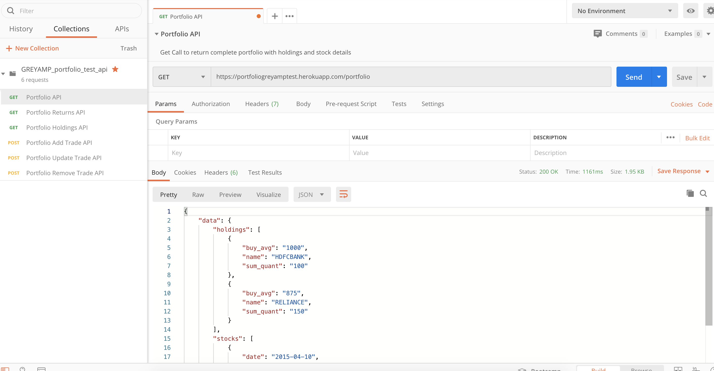
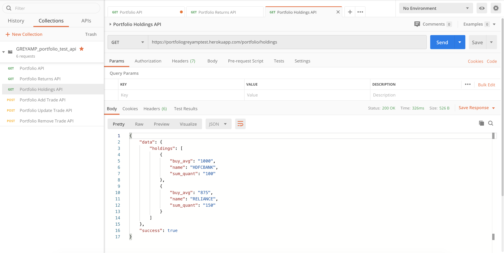
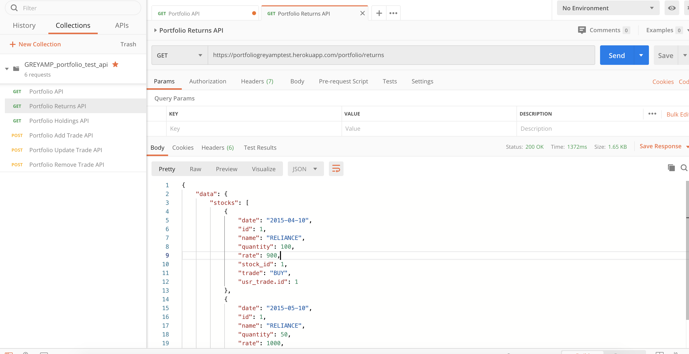
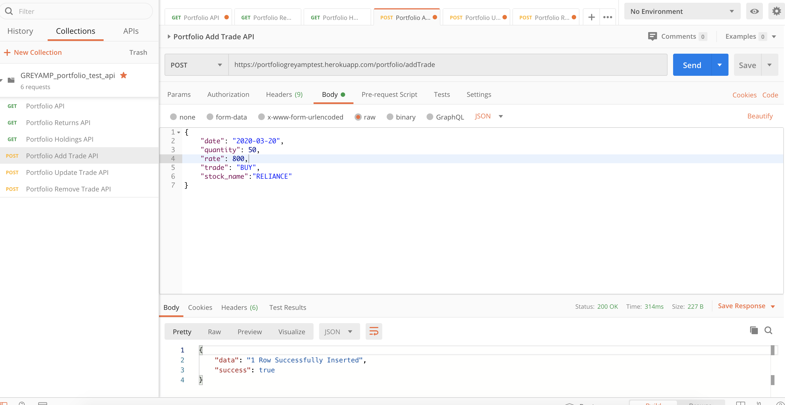
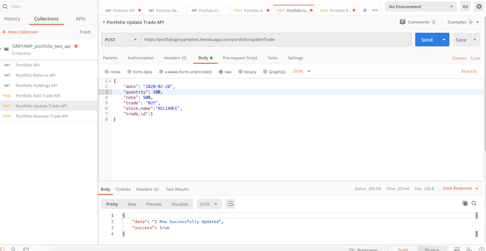
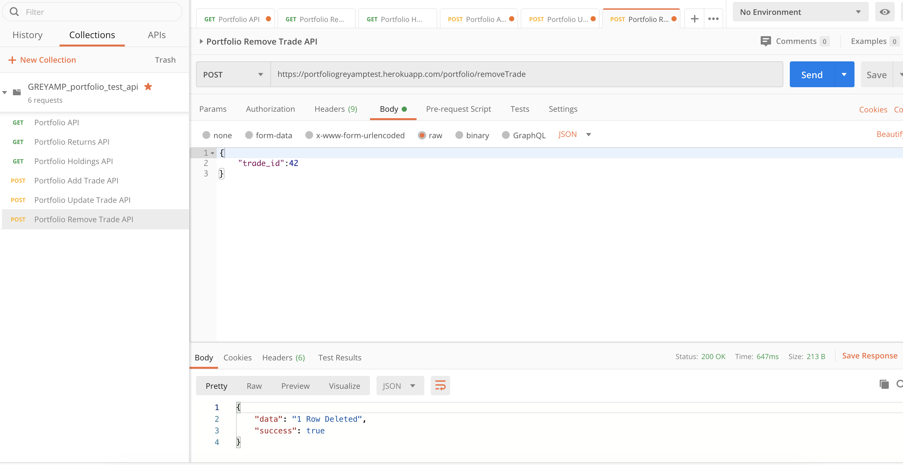
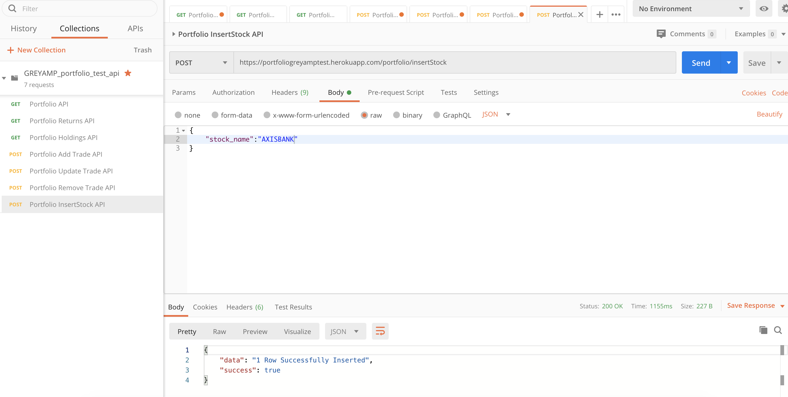

&nbsp;&nbsp;&nbsp;&nbsp;&nbsp;&nbsp;&nbsp;&nbsp;&nbsp;&nbsp;&nbsp;&nbsp;&nbsp;
&nbsp;&nbsp;&nbsp;&nbsp;&nbsp;&nbsp;&nbsp;&nbsp;&nbsp;&nbsp;&nbsp;&nbsp;&nbsp;


[](https://github.com/utkarshut/portfoliogreyamptest/issues)

<br><br>
**Database** 

ClearDB , ClearDB on Heroku enables you to build your apps using native MySQL databases
(https://elements.heroku.com/addons/cleardb)

**REST Framework**

FLASK , Flask-RESTful is an extension for Flask that adds support for quickly building REST APIs. It is a lightweight abstraction that works with your existing ORM/libraries. Flask-RESTful encourages best practices with minimal setup
(https://flask-restful.readthedocs.io/en/latest/)

**Deployment Server**

Heroku, Heroku is a platform as a service (PaaS) that enables developers to build, run, and operate applications entirely in the cloud
(www.heroku.com)

**File Details** 

## Features

### Portfolio

- Endpoint - https://portfoliogreyamptest.herokuapp.com/portfolio
- Method - GET
- Example :




### Portfolio Holdings

- Endpoint - https://portfoliogreyamptest.herokuapp.com/portfolio/holdings
- Method - GET
- Example :




### Portfolio Returns

- Endpoint - https://portfoliogreyamptest.herokuapp.com/portfolio/returns
- Method - GET
- Example :



### Portfolio Add Trade

- Endpoint - https://portfoliogreyamptest.herokuapp.com/portfolio/addTrade
- Method - POST
- Payload Sample - 
{
    "date": "2020-03-20",
    "quantity": 50,
    "rate": 800,
    "trade": "BUY",
    "stock_name":"RELIANCE"
}
- Example :




### Portfolio Update Trade

- Endpoint - https://portfoliogreyamptest.herokuapp.com/portfolio/updateTrade
- Method - POST
- Payload Sample -
{
    "date": "2020-02-20",
    "quantity": 100,
    "rate": 500,
    "trade": "BUY",
    "stock_name":"RELIANCE",
    "trade_id":1
}
- Example :




### Portfolio Remove trade

- Endpoint - https://portfoliogreyamptest.herokuapp.com/portfolio/removeTrade
- Method - POST
- Payload Sample -
{
    "trade_id":42
}
- Example :



### Portfolio Add Stock Name

- Endpoint - https://portfoliogreyamptest.herokuapp.com/portfolio/insertStock
- Method - GET
- Payload Sample -
{
	"stock_name":"AXISBANK"
}
- Example :



## Setup
``` 
https://github.com/utkarshut/portfoliogreyamptest
cd portfoliogreyamptest
pip install -r requirements.txt
python app.py
```
